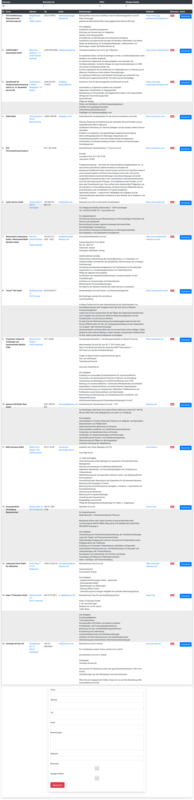

# PHP-Webseite um die Übersicht über **Bewerbungen** zu behalten.

Eine Webseite die ich verwende wenn ich Bewerbungen schreibe um den Überblick zu behalten.
Im Backend ist eine MySQL-Datenbank.

 

## Wozu ist es gut?

Es können mit dieser Webseite Bewerbungen gemanaged werden.
Adressen gesammelt und der Status festgehalten werden, ob man sich bei dem Unternehmen beworben hat und ob eine Absage vorliegt.

- Adressen werden mit Google-Maps geöffnet
- Es können Telefonnummern und Email-Adressen gespeichert werden.
- Bemerkungen gespeichert werden, wie zB.: Ansprechpartner.
- Die URL zur Webseite des Unternehmen.
- Jeder Eintrag hat einen Button um den Eintrag zu editieren.
- Es kann vermerkt werden ob
    - eine Bewerbung geschickt wurde
    - eine Absage erhalten wurde

## Die Webseite einrichten.

- MySQL-Datenbank einrichten - Tabellen anlegen durch importieren der `bewerbungen.sql` in eine Datenbank.
- Die Datei `server.php` editieren und die Zugangsdaten zur Datenbank eintragen.

Es muss eine MySQL-Datenbank eingerichtet werden.
In die Datenbank dann die Datei `bewerbungen.sql` importieren.

Danach müssen die Zugangsdaten in die Datei `server.php` eingetragen werden.

### Wie die Webseite aussieht.

